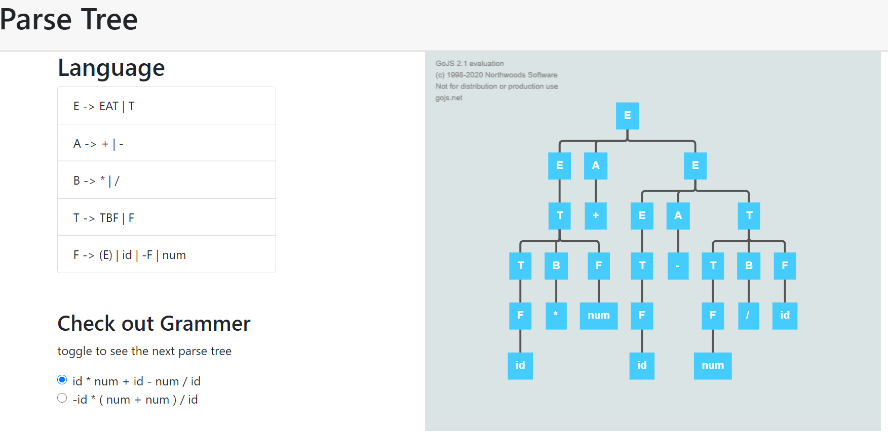

# Parse Tree
### In this assignment i generate parse tree of grammer language in course compiler construction using **[GoJS](https://gojs.net/latest/learn/index.html)** library

Here is how app is looking

